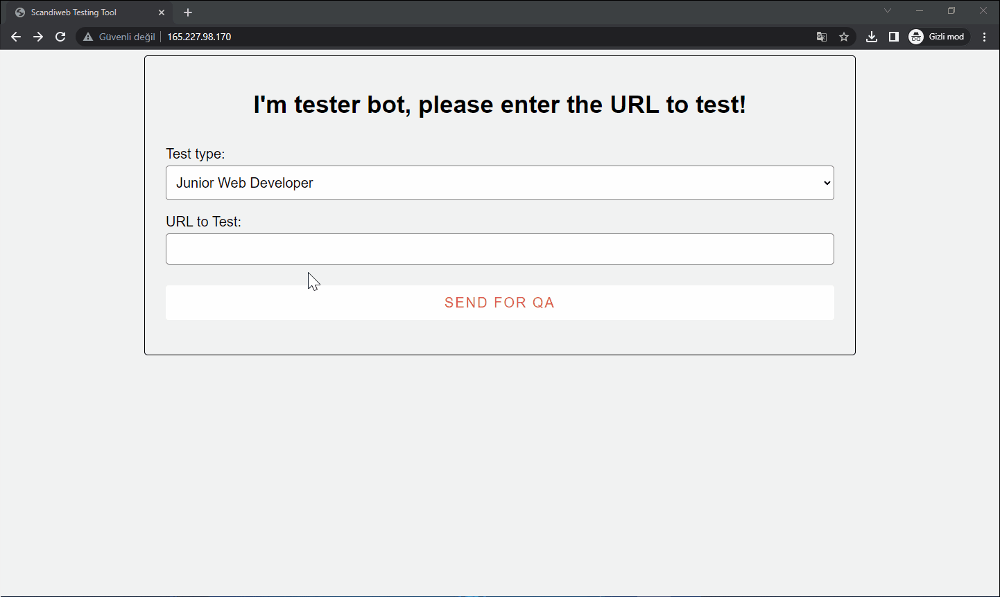

# Junior Developer Test Task

For this task, I have created a php rest api where you can find at the main branch in the backend folder.

To use this api, I have created a simple react frontend where you can find at the main branch in the frontend folder.

## Usage

To use this api, you need to have a local server running on your machine. I have used WAMP for this task.
After you have installed WAMP, you need to start the Apache and MySQL services. Then you should place the backend and frontend folder to the www folder in the WAMP folder. (htdocs in XAMPP, it's my preferred folder structure)

 
Then you need to create a database called "scandiwebdb" and import the scandiwebdb_sefaesendemir.sql file given to you.
After that you should change the database credentials in the backend folder's config.php file. Now you can run the api on your local server.

After that, you need to go to the frontend folder and run the following command:
```
yarn
```
This will install the necessary node modules for the frontend.

Before starting the frontend, you need to change the baseURL in the src/api.js file to your local server address with respect to your folder structure.

After that, you can start the frontend by running the following command:
```
yarn start
```

## Auto QA Test Result


